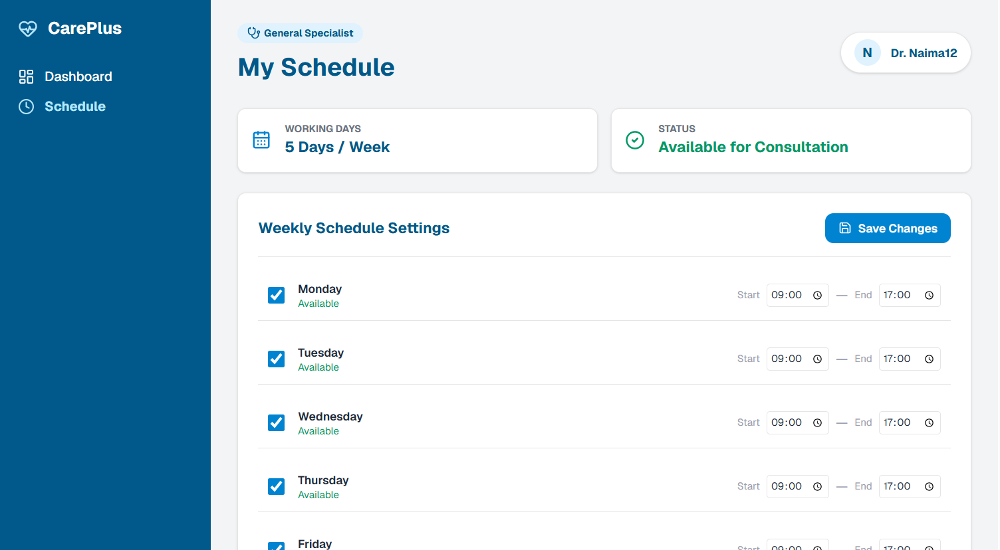

# 🏥 CarePlus Clinic Management System

CarePlus is a modern and responsive healthcare management web application built with React and Tailwind CSS. The system allows patients to find doctors, search by specialty, and book appointments. It also provides a Doctor Dashboard for managing appointments, patients, and schedules.

---

## ✨ Features

### 🌐 Patient Portal

- **Home & Landing Page**: Overview of the clinic, services, and easy navigation.
- **Doctors Directory**: Browse doctors by specialty, experience, and availability.
- **Search & Filter**: Search doctors by name or specialty and filter by medical specialty.
- **Appointment Booking**: Select a doctor, date, time, and provide patient details and reason for visit.
- **Login Before Booking**: Users must log in before accessing the booking form.
- **Appointment Confirmation**: View appointment details after successfully booking.

### 🩺 Doctor Dashboard

- **Secure Authentication**: Firebase Authentication for login and registration.
- **Dashboard Overview**: View total, pending, confirmed, and cancelled appointments.
- **Appointment Management**: Confirm, cancel, and delete appointments.
- **Patient Management**: View and search patients who have booked appointments.
- **Schedule Management**: Set working days and working hours for the logged-in doctor.
- **Local Storage**: Appointment and schedule information remains available after refreshing the page.

---

## 📸 Screenshots

### Home Page


### Doctors Page


### Schedule Page


---

## 🛠️ Technologies Used

- React
- JavaScript
- Tailwind CSS
- Vite
- React Router
- Firebase Authentication
- Firebase Firestore
- Lucide React
- Local Storage

---

## 📁 Project Structure

```text
careplus/
├── public/
├── src/
│   ├── assets/
│   ├── components/
│   │   ├── ui/
│   │   ├── Cards.jsx
│   │   ├── Footer.jsx
│   │   ├── Navbar.jsx
│   │   └── Specialties.jsx
│   ├── lib/
│   │   ├── firebase.js
│   │   └── utils.js
│   ├── pages/
│   │   ├── BookAppointment.jsx
│   │   ├── DoctorDashboard.jsx
│   │   ├── Doctors.jsx
│   │   ├── Home.jsx
│   │   ├── Login.jsx
│   │   ├── Patients.jsx
│   │   ├── Schedule.jsx
│   │   └── SignUp.jsx
│   ├── App.css
│   ├── App.jsx
│   ├── index.css
│   └── main.jsx
├── .env
├── .gitignore
├── components.json
├── LICENSE
├── package.json
├── README.md
└── vite.config.js